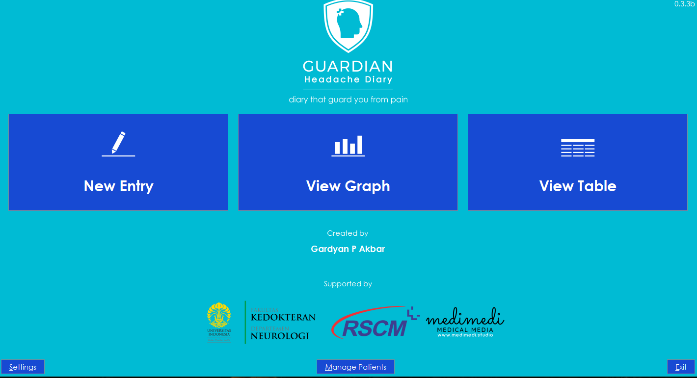
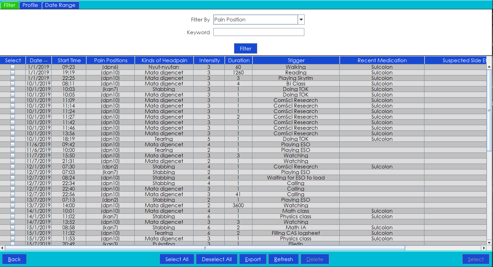

<div id="top"></div>

<!-- PROJECT SHIELDS -->
<!--
*** I'm using markdown "reference style" links for readability.
*** Reference links are enclosed in brackets [ ] instead of parentheses ( ).
*** See the bottom of this document for the declaration of the reference variables
*** for contributors-url, forks-url, etc. This is an optional, concise syntax you may use.
*** https://www.markdownguide.org/basic-syntax/#reference-style-links
-->
<!-- [![Contributors][contributors-shield]][contributors-url]
[![Forks][forks-shield]][forks-url]
[![Stargazers][stars-shield]][stars-url]
[![Issues][issues-shield]][issues-url]
[![MIT License][license-shield]][license-url] -->
<!-- [![LinkedIn][linkedin-shield]][linkedin-url] -->


<!-- PROJECT LOGO -->
<br />
<div align="center">
  <a href="https://github.com/GiantSweetroll/Headpain-Diary">
    
  </a>

  <h3 align="center">Guardian Headache Diary</h3>

  <p align="center">
    An app to log your head pains and look back to see trends
  </p>
</div>
<br>


<!-- TABLE OF CONTENTS -->
<details>
  <summary>Table of Contents</summary>
  <ol>
    <li>
      <a href="#about-the-project">About The Project</a>
      <ul>
        <li><a href="#built-with">Built With</a></li>
      </ul>
    </li>
    <li>
      <a href="#getting-started">Getting Started</a>
      <ul>
        <li><a href="#prerequisites">Prerequisites</a></li>
        <li><a href="#installation">Installation</a></li>
      </ul>
    </li>
    <li><a href="#usage">Usage</a></li>
    <!-- <li><a href="#roadmap">Roadmap</a></li> -->
    <!-- <li><a href="#contributing">Contributing</a></li> -->
    <!-- <li><a href="#license">License</a></li> -->
    <li><a href="#acknowledgments">Acknowledgments</a></li>
    <li><a href="#screenshots">Screenshots</a></li>
  </ol>
</details>


<!-- ABOUT THE PROJECT -->
## About The Project

Guardian Headache Diary is a desktop application to help patients suffering from head pains by providing them a platform to take note or record their episodes. They will be able to view their past recordings and view it in a graph or tabular format. They can send this information to their doctors and work together to form the best treatment.

This project was my first big project in programming and I developed it firstly for my own use, as I was suffering with head pains after my first brain surgery attempting to remove my brain tumor. The idea was to create an application where the user (or patient) can easily input their head pains with minimal hassle. I try to find the balance between the needs of the doctors and the patient. Doctors need a lot of information, while patients do not want to input too many things. I try to find the middleground between the two, so that we can get the best out of both worlds.

This project is in partnership with FKUI, RSCM Kencana, and Medical Media.

<div align="right">(<a href="#top">back to top</a>)</div>


### Built With

This project was made using [Java](https://www.java.com/en/).

<div align="right">(<a href="#top">back to top</a>)</div>


<!-- GETTING STARTED -->
## Getting Started

To get a local copy of the project up and running , follow these simple steps.

### Prerequisites
- JDK 8 (or newer)
- [GG-Library](https://github.com/GiantSweetroll/GG-Library)
- [Eclipse](https://www.eclipse.org/ide/) (Optional)

<i>Note: This project was created using the Eclipse IDE and is recommended to open and edit the contents of the project. You may use other IDEs that suits your best.</i>

### Installation

1. Clone the repo
   ```sh
   git clone https://github.com/GiantSweetroll/Headpain-Diary.git
   ```
2. Configure the build path to point to where you downloaded GG-Library and JDK in your local machine
3. Run `Main.java`

<div align="right">(<a href="#top">back to top</a>)</div>


<!-- USAGE EXAMPLES -->
## Usage
The app is in Indonesian by default but you may change to English translation in the application settings.

To see how to use the app, please refer to `Usage.pdf` location at `docs/Usage.pdf`.


<!-- ACKNOWLEDGMENTS -->
## Acknowledgments

* [FKUI](https://fk.ui.ac.id/)
* [Medical Media](https://www.linkedin.com/company/medimedi/)
* [RSCM Kencana](https://rscm.co.id/index.php?XP_webberanda_menu=0&title=Rumah%20Sakit%20Cipto%20Mangunkusumo)

<div align="right">(<a href="#top">back to top</a>)</div>

<!-- SCREENSHOTS -->
## Screenshots






<div align="right">(<a href="#top">back to top</a>)</div>